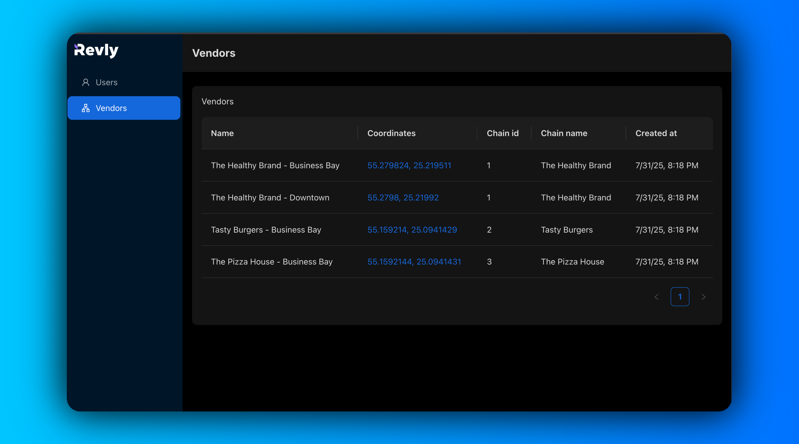
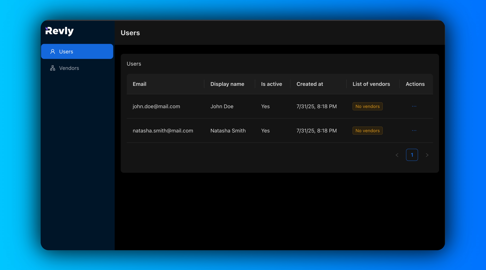
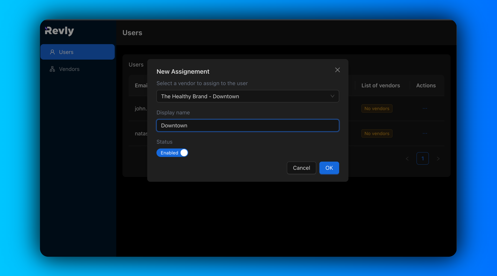

# Revly Case Study Web App

A very simple web app for managing vendors and users.

## 1. Quick Start

- Prerequisites
  - Node.js
  - npm or yarn (I used npm)
- Clone & run commands

  - `npm install`
  - `cp .env.example .env` (Fill in the .env file with the correct values)

- Setup the database

  - `npx drizzle-kit push` (to push the schema to the database)
  - `npm run seed` (to seed the database with the data)
  - `npx drizzle-kit studio` (to view the database in a nice UI)

- Run the app

  - `npm run dev`

## 2. What's Inside

- Vendors page
- Users page
- New assignement modal
- Update user status (enabled/disabled)

## 3. Tech Stack

- TypeScript
- Next.js (with app router and api routes)
- Drizzle ORM
- Ant Design
- React Query
- Zod

## 4. Screenshots

- 
- 
- 

## 5. What's Next

- Theres so many aspects to this project that I could have improved on, and make it scale-ready. didn't have time to do it, but I would have:
  - Add a redis instance to cache the data that is fetched more often (i've already added a client caching using react query), but i still need to add a server caching.
  - Add a full secure authentication system, with a way to manage users and roles.
- And so many more things ... that i can bring to the table during the interview 😁

Happy coding !
